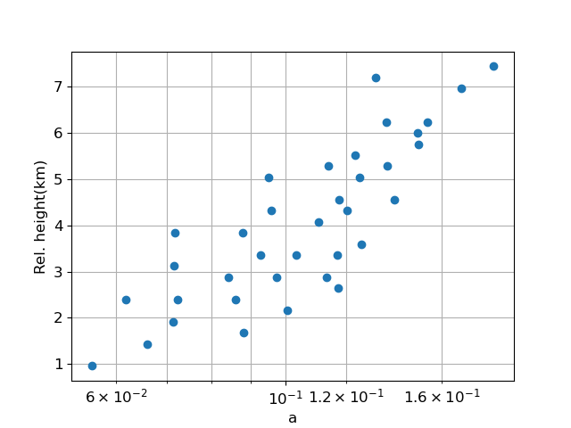
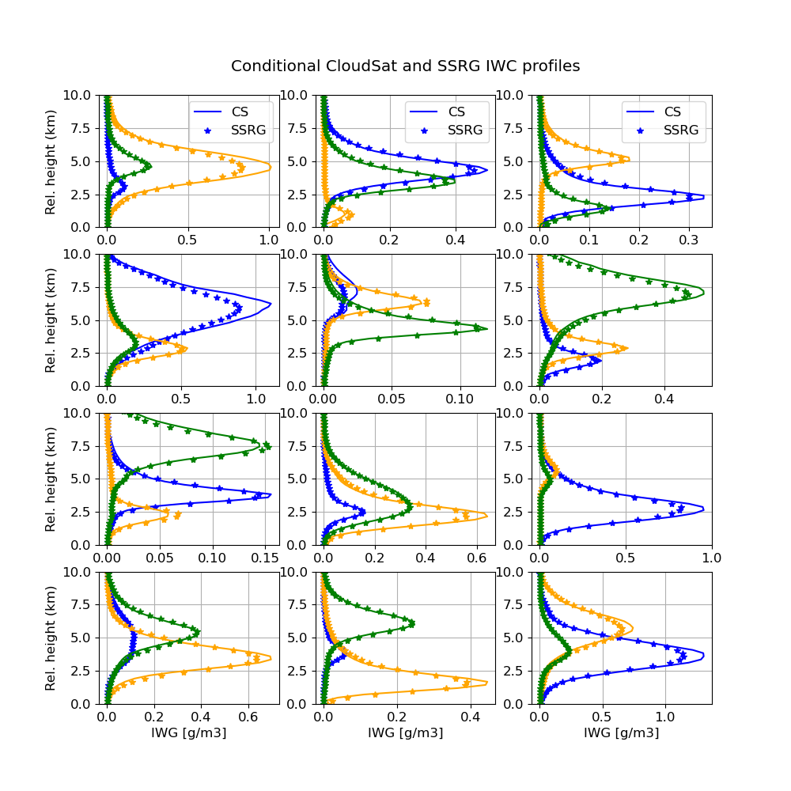

### Synergistic retrievals of ice in high clouds from lidar, Ku-band radar and submillimeter wave radiometer observations
**_Mircea Grecu and John Yorks_**

### 1.Introduction ###
The future NASA Atmospheric Observing System (AOS) mission (Braun 2022) is expected to feature new combinations of observations that may be used to quantify the amounts of ice in high clouds and characterize the microphysical properties of ice particles. These observations include lidar backscatter, Ku-band radar reflectivity and submillimeter wave radiometer brightness temperature measurements.  While not optimal for cloud ice estimation, but for the characterization of a broader spectrum of cloud and precipitation processes, these observations are nevertheless synergistic from the cloud ice perspective. That is, despite the fact that lidar observations attenuate quickly in thick ice clouds and the Ku-band radar will not be able to detect clouds characterized by an echo weaker than 8.0 dBZ, the active observations are expected to provide context that may be incorporate into the radiometer retrievals. In this study, we investigate the impact of incorporating the lidar and radar observations into the radiometer retrieval of ice clouds. Because the existent amount of coincident backscatter lidar, Ku-band radar, and submillimeter wave radiometer observations is rather insufficient to derive conclusive results, we employ accurate physical models to simulate the lidar, radar and radiometer observations and use a cross-validation methodology to characterize the retrieval accuracy. As retrievals from passive instrument observations strongly depend on the "a priori" information (Rodgers 2000), for the results to be relevant in real applications it is necessary to base them on realistic vertical distributions of ice properties.  Such distributions may be derived from cloud-resolving-model (CRM) simulations (Pfreundschuh et al. 2020) or directly from observations.  In this study, we employ the latter approach, as CRMs may still be deficient in properly reproducing the vertical distribution of ice clouds and their associated microphysical properties.

### 2. Methdology ###
As previously mentioned, we use CloudSat (CS) observations to derive the vertical distributions of ice properties needed in the investigation (Stephens et 2002).  Although research quality CS cloud ice products exist, to maximize the physical consistency of the approach, we do not use them and derive ice amounts and associated properties from CS reflectivity observations.  This ensures the consistency between the particle distribution assumption and electromagnetic scattering properties used in the CS reflectivity processing and those used the simulation of the lidar, Ku-band radar and radiometer observations.  However, the 

The electromagnetic scattering properties are calculated using software scatter-1.1 (Hogan 2019), which is based on the self-similarity Rayleigh-Gans approximation (SSRGA) of Hogan et al. (2017). The SSRGA theory was developed for millimeter-wave calculations and may not be applicable at lidar's wavelength.  Therefore, for lidar calculations we are using the Mie solution of scatter-1.1. Although more accurate calculations based on more realistic ice particle shapes exist, they are rather incomplete and not readily available.  Moreover, Wagner and Deleny (2022) compared lidar backscatter observations with backscatter calculations based on coincident PSD observations and the Mie solution and found good agreement, which suggests that electromagnetic properties derived from Mie calculations are adequate for practical applications. The lidar molecular backscatter and extinction are calculated using the lidar module of COSP stands for CFMIP Observation Simulator Package (COSP; Bodas-Salcedo et al. 2011).  To account for multiple-scattering in the lidar observations, we are using the multiscatter-1.2.11 model (Hogan 2015) of Hogan and Battaglia (2008).

A k-means clustering algorithm is used to group the ice water content profiles into 36 classes.

### _References_ ###

* Bodas-Salcedo, A., Webb, M. J., Bony, S., Chepfer, H., Dufresne, J., Klein, S. A., Zhang, Y., Marchand, R., Haynes, J. M., Pincus, R., & John, V. O. (2011). COSP: Satellite simulation software for model assessment, Bulletin of the American Meteorological Society, 92(8), 1023-1043. Retrieved Jul 3, 2022, from https://journals.ametsoc.org/view/journals/bams/92/8/2011bams2856_1.xml

* Braun and co-authors, 2022. Aerosol, Cloud, Convection, and Precipitation (ACCP) Science and Applications https://aos.gsfc.nasa.gov/docs/ACCP_Science_Narrative-(March2022).pdf

* Brogniez, H., Roca, R., Auguste, F., Chaboureau, J.P., Haddad, Z., Munchak, S.J., Li, X., Bouniol, D., Dépée, A., Fiolleau, T. and Kollias, P., 2022. Time-delayed tandem microwave observations of tropical deep convection: Overview of the C2OMODO mission. Frontiers in Remote Sensing.

* Hogan, R.J., Honeyager, R., Tyynelä, J. and Kneifel, S., 2017. Calculating the millimetre‐wave scattering phase function of snowflakes using the self‐similar Rayleigh–Gans Approximation. Quarterly Journal of the Royal Meteorological Society, 143(703), pp.834-844.

* Hogan, R.,J., 2019. scatter-1.1. Retrieved from http://www.met.reading.ac.uk/clouds/ssrga/scatter-1.1.tar.gz

* Pfreundschuh, S., Eriksson, P., Buehler, S.A., Brath, M., Duncan, D., Larsson, R. and Ekelund, R., 2020. Synergistic radar and radiometer retrievals of ice hydrometeors. Atmospheric Measurement Techniques, 13(8), pp.4219-4245.

* Rodgers, C.D., 2000. Inverse methods for atmospheric sounding: theory and practice (Vol. 2). World scientific.

* Stephens, G.L., Vane, D.G., Boain, R.J., Mace, G.G., Sassen, K., Wang, Z., Illingworth, A.J., O'connor, E.J., Rossow, W.B., Durden, S.L. and Miller, S.D., 2002. The CloudSat mission and the A-Train: A new dimension of space-based observations of clouds and precipitation. Bulletin of the American Meteorological Society, 83(12), pp.1771-1790.