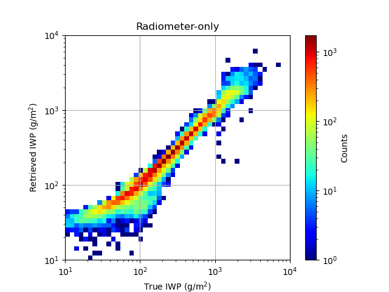
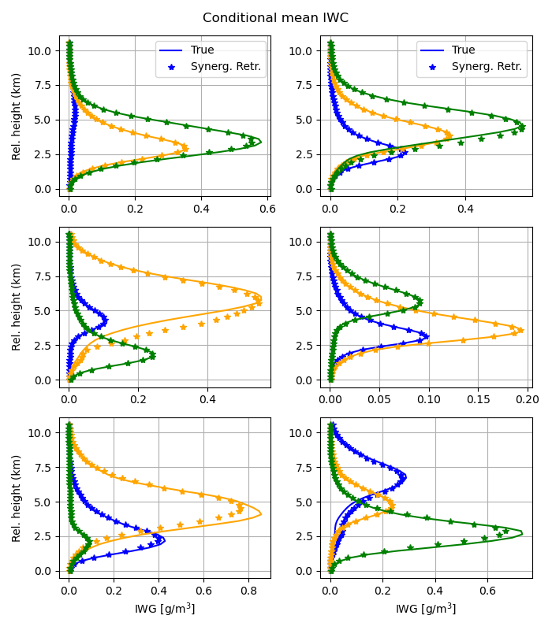
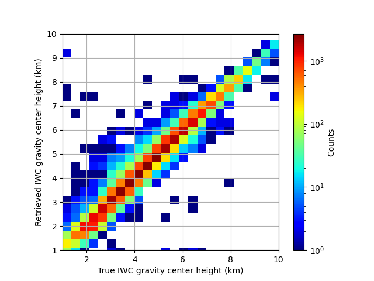

### Synergistic retrievals of ice in high clouds from lidar, Ku-band radar and submillimeter wave radiometer observations

**_Mircea Grecu and John Yorks_**

### 1.Introduction ###
The future NASA Atmospheric Observing System (AOS) mission (Braun 2022) is expected to feature new combinations of observations that may be used to quantify the amounts of ice in high clouds and characterize the microphysical properties of ice particles. These observations include lidar backscatter, Ku-band radar reflectivity and submillimeter wave radiometer brightness temperature measurements.  While not optimal for cloud ice estimation, but for the characterization of a broader spectrum of cloud and precipitation processes, these observations are nevertheless synergistic from the characterization of ice clouds perspective. That is, despite the fact that lidar observations attenuate quickly in thick ice clouds and the Ku-band radar will not be able to detect clouds characterized by an echo weaker than 8.0 dBZ, the active observations are expected to provide context that may be incorporated into radiometer retrievals. In this study, we investigate the impact of incorporating the lidar and radar observations into the radiometer retrieval of ice clouds. Because the existent amount of coincident backscatter lidar, Ku-band radar, and submillimeter-wave radiometer observations is rather insufficient to derive conclusive results, we employ accurate physical models to simulate the lidar, radar and radiometer observations and use a cross-validation methodology to characterize the retrieval accuracy. As retrievals from passive instrument observations strongly depend on the "a priori" information (Rodgers 2000), for the results to be relevant in real applications it is necessary to base them on realistic vertical distributions of ice properties.  Such distributions may be derived from cloud-resolving-model (CRM) simulations (Pfreundschuh et al. 2020) or directly from observations.  In this study, we employ the latter approach, as CRMs may still be deficient in properly reproducing the vertical distribution of ice clouds and their associated microphysical properties.

### 2. Methdology ###
As previously mentioned, we use CloudSat (CS) observations (Stephens et 2002) to derive the vertical distributions of ice properties needed in the investigation.  Although research quality CS cloud ice products exist, to maximize the physical consistency of the approach, we do not use them but derive ice amounts and associated properties from CS reflectivity observations.  This ensures the consistency between the particle distribution assumptions and the electromagnetic scattering properties used in the CS reflectivity processing and those used the simulation of the lidar, Ku-band radar and radiometer observations.  Lidar, Ku-band radar and submillimeter-wave radiometer observations are simulated from CS observations using accurate physical models and realistic assumptions consistent with the most recent knowledge in the field of ice cloud microphysics, and a simple, but effective, non-parametric estimation methodology based on the k-nearest neighbors algorithm is used to investigate the instrument synergy.  Details of the methodology are presented below.

#### 2.1. Assumptions and forward models
To quantify the number of ice particles in an elementary atmospheric volume as a function of their size, we use normalized gamma functions (Bringi et al. 2003).  The benefit of normalized gamma functions is that encapsulate the variability of Ice Water Content (IWC) - reflectivity relationship into a single parameter, i.e. the normalized Particle Size Distribution (PSD) intercept (Testud et al. 2001; Bringi et al. 2003). The normalized PSD intercept is defined as $N_w=\frac {4^4} {\pi \rho_w} \frac {IWC} {D_m^4}$, where $IWC$ is the ice water content associated with the PSD, and $D_m$ is the mass weighted mean diameter.  Testud et al. (2001) showed that the variability in IWC reflectivity (Z) relationships may be fully explained by variability in $N_w$, and that formulae of the type 

$IWC=N_w^{1-b}aZ^b$

perfectly explain the relationships between IWC and Z calculated from observed PSDs. Equation (1) is not sufficient to derive accurate, unbiased estimates of ice water contents, because $N_w$ varies considerably in time and space. Nevertheless, multiple studies showed that it is beneficial to parameterize $N_w$ as a function of temperature (e.g. Hogan et al. 2006; Delanoe and Hogan 2008; Deng et al. 2010).  In this study we parameterize $N_w$ as a function of temperature based on the CloudSat 2C-ICE product (Deng et al. 2010; Deng et al. 2013).  Specifically, we cluster, based on their similarity, a large set 2C-ICE profiles into 18 classes using a k-Means procedure. The mean IWC profiles associated with the 18 classes are shown in continuous lines in Fig. 1.  Alternative estimates, based on the PSD assumptions and electromagnetic scattering calculations that enable accurate and physically consistent simulations of radar observations at Ku-band and radiometer observations of submillimeter-wave frequencies are also shown in Fig. 2 (symbolized as SSRG). Details regarding the estimations process are provided in the subsequent paragraphs.  As apparent in Fig. 1, the CS and SSRG estimates are in good agreement.  Some discrepancies due to discrepancies in the SSRG $N_w$ parameterization and the CS 2C-ICE "a priori assumptions" are also apparent, but they are not deemed critical in this study, whose objective is the investigation of synergistic lidar, Ku-band radar and submillimeter-wave radiometer retrievals, because the outcome is not likely to be sensitive to such details.

Fig.1 Conditional average IWC profiles for each of the 18 classes determined by the k-Means algorithm. The CS 2C-ICE profiles (Deng et al. 2013) are shown in continuous line, while the profiles derived in this are shown using the "*" symbol and referred to the SSRG estimates due to the use the self-similarity Rayleigh-Gans approximation (SSRGA) theory in the estimation process (see the text for details).  The relative height is defined relative to the freezing level.

 One may notice that the average IWC profiles in Fig.1 are characterized by different peak values and locations.  This facilitates a simple way to reverse-engineer to (some extent) the "a priori" assumptions used in the CS 2C-ICE product and use them in formulation of the type described in Eq. (1).  Specifically, the conditional derivation of relationships of the type $IWC=a_i Z^{b_i}$ for every class i and the representation of $a_i$ as a function of the height of class IWC peak. Shown in Fig. 2 is a relative height - $a_i$ scatter plot.  As apparent in the figure, and as expected, the $a_i$ exhibits a strong variation with the relative height. Coefficient $b_i$ exhibits a height dependency as well, but the range of variation is significantly smaller, almost zero relative to the mean value of $b$. Given that any deviation of the multiplicative coefficient in an IWC-Z relation from an average is equivalent to a deviation of the associated $N_w$ from its mean value (Testud et al. 2001), the relative height $a$ relationship may be converted into a relative-height $N_w$ relationship.  We, therefore, use the data in Fig. 2 to parameterize $N_w$ as a function of the relative height.

 
Fig. 2.

 For the determination of the reference $a$ and $b$ values, we assume that PSDs are normalized gamma distributions with $N_w=0.08cm^{-4}$ and $\mu=2$ and calculate 
 
 $Z=\frac {\lambda ^4} {\pi ^5 |K_w|^2} \int_0^{\infty} N(D,D_m) \sigma _b(D) dD$ 
 
where $\lambda$ is the radar frequency, $|K_w|$ is the dielectric factor of water, $N(D,D_m) dD$ is the number of ice particles of diameter with D and D+dD per unit volume, $D_m$ is the mass weighted mean diameter of the distribution, and $\sigma _b(D)$ is the backscattering cross-section of ice particle of diameter $D$. The mass weighted mean diameter is equidistantly sampled to span the entire range of IWC values in the CS 2C-ICE dataset. The assumed mass-size relation is that of Brown and Francis (1995) because it works well with the self-similarity Rayleigh-Gans approximation (SSRGA) of Hogan et al. (2017) upon the electromagnetic scattering property calculations are based (Heymsfield et al. 2022).  The open source software scatter-1.1 of Hogan (2019) is used to provide the actual scattering properties. The SSRGA theory was developed for millimeter and submillimeter-wave calculations and may not be applicable at lidar's wavelength.  Therefore, for lidar calculations, we are using the Mie solution of scatter-1.1. Although more accurate calculations based on more realistic ice particle shapes exist, they are rather incomplete and not readily available.  Moreover, Wagner and Deleny (2022) compared lidar backscatter observations with backscatter calculations based on coincident PSD observations and the Mie solution and found good agreement, which suggests that electromagnetic properties derived from Mie calculations are adequate for practical applications. The lidar molecular backscatter and extinction are calculated using the lidar module of COSP stands for CFMIP Observation Simulator Package (COSP; Bodas-Salcedo et al. 2011).  To account for multiple-scattering in the lidar observations, we are using the multiscatter-1.2.11 model (Hogan 2015) of Hogan and Battaglia (2008).

The radiometer observations are calculated using a one-dimensional efficient, but accurate, radiative transfer solver based on Eddington's approximation (Kummerow 1993). The Eddington's approximation has been found to work well in cloud and precipitation retrieval application despite its simplicity relative to more general (but also computationally intensive) approaches such as the Monte Carlo radiative transfer solvers (Liu et al. 1996). It should be noted tough that the phase functions of ice particles tend to be highly asymmetric at sub-millimeter wave frequencies. For radiative transfer solutions based on the Eddington's approximation to be accurate it is necessary that the delta-scaling approach (Joseph et al. 1976) be employed. The delta-scaling approach transforms the initial radiative transfer equation into an equivalent one characterized by a less asymmetric scattering function, but more extinction and making the solution Eddington approximation more stable and accurate. The absorption due to water vapor and other gases is quantified using the Rosenkranz model (Rosenkranz 1998).  The water vapor, temperature and pressure distributions are derived based on a WRF simulation of summer convection over the United States.  Specifically, the water vapor, temperature and pressure profiles associated with times and areas where the model produces anvils are selected and clustered into 40 classes.  The mean extinction profiles at the radiometer frequencies are calculated for every class and used in process of calculating the brightness temperatures from the estimated ice profiles using a simple Monte Carlo procedure.  That is, given a retrieved ice profile and its scattering property, an anvil class and its associated absorption, temperature and pressure profiles are randomly selected and attached to the ice scattering properties. To make the procedure physically meaningful, temperature rather than height is used in the ice scattering-gas absorption collocation process.  The emissivities are randomly chosen between 0.8 and 1.0 and assumed constant for all radiometer frequencies.  Brightness temperatures are calculated at 89-, 183.31 ± 1.1, and 325.15 ± 1.5 GHz, which correspond to three of the 10 channels of the SAPHIR-NG radiometer envisioned to be deployed in the AOS mission (Brogniez et al. 2022).  The other channels are centered on the same a/water vapor absorption lines and are not likely to offer additional information in this rather controlled experiment. Nevertheless, the other channels are expected to be useful in reducing the uncertainties caused by variability in the vertical distribution of water vapor, which may be greater in real life than in the simulated environment. 

The processing steps used to process the CS reflectivity observations and calculate the lidar, Ku-band and submillimeter-wave radiometer observations may be summarized as follows:
1. Derivation of physically consistent radar and radiometer lookup tables to relate basic radar and radiometer properties (e.g. reflectivity, attenuation, extinction, scattering-albedo, etc.) to PSD parameters such as $IWC$ and $D_m$. The tables are derived for a single of $N_w$, but are usable with any value of $N_w$ using the "normalization" operations described in Grecu et al. (2011)
2. Derivation of Nw-relative height parameterization using the 2C-ICE product.
3. Estimation of IWC and related PSD parameters from CS W-band radar observations, using the tables constructed in Step 1 and parameterization derived in Step 2.
4. Calculation of lidar, Ku-band radar and radiometer observations from the estimates derived in Step 3 and the tables obtained in Step 1.

The application of these steps produces a large dataset of approximately 200,000 cloud ice profiles and associated lidar, radar and radiometer observations that may be used to investigate the synergy of the three sensors. Details are provided in the next section.

### 2.2. Estimation and evaluation

Given that the lidar observations may attenuate quickly in thick clouds, while the Ku-band radar will not detect clouds with an echo weaker than 8.0 dBZ, the radiometer is the instrument likely to provide by itself the most complete information about the total amount of ice in its observing volume.  However, the vertical distribution of ice is difficult to quantify from radiometer-only observations, because significantly different vertical ice distributions may lead to very similar radiometer observations.  This makes radiometer-only retrievals highly dependent on the "a priori" information on the distribution of ice clouds in the atmosphere. As previously mentioned, this is the reason why CS-based IWC retrievals were preferred to CRM simulations, as retrievals are expected to exhibit a more natural and less biased distribution. By the same token, a retrieval procedure whose results are intuitively explainable is preferable to a potentially more accurate but less interpretable procedure.  Therefore, in this study we use an estimation methodology based on the k-Nearest Neighbors (kNN) algorithm (Hastie et al. 2009). Given a value for k and a brightness temperature input, the KNN regression first identifies the k training observations that are closest to the input. It then estimates the variable of interest as the weighted average of all the training responses. The algorithm is efficient because, at the prediction time, the input is not simply compared to all the records in the training database. Instead, the training dataset is recursively partitioned into disjoint structures called quad-trees (de Berg et al. 2008) that do not require exhaustive searches for the closest neighbor identification. In this study, we use the kNN regression implementation of Pedegrosa et al. (2011).  The number of nearest neighbors, k, is set to 30. Results do not appear to be sensitive to the value of k as long is large enough (at least 10) to prevent the derivation of noisy estimates. Larger values do not change the estimates noticeably, but can slow the estimation process due to extra-processing steps.

Mathematically, the estimation procedure may be mathematically formulated as a function $Y=f(X)$, where $Y$ are the ice properties that need to be estimated (e.g. the ice water path (IWC), the IWC at a given height, etc.) and $X$ is the set of observations. To investigate the synergy between instruments, we start with $X$ as the set of radiometer brightness temperature and continue by adding lidar and radar observations or features. Here, a feature is defined as property derived by processing some observations (e.g. the height of the lidar maximum backscatter, or the top of the lidar particle backscatter).

<!--- an inverse problem is a problem in which the goal is to find the input variables that produce a given output. -->

A cross validation methodology is used for evaluation.  That is, the kNN regression is trained on 70% of the data and evaluated on the remaining 30% of the data.  The partition of the data into training and evaluation subsets is done randomly.  Usually, the partition, training and evaluation steps are repeating several times.  However, given the fact that differences in the relationships between the ice property and their associated simulated observations are functions of the meteorological context, and that all regimes are well-sampled in both the training and testing subsets (e.g. out of every 10 pixels in a scene, about 7 end-up in the training dataset, while the others in the testing dataset), the repetition of the partition, training, and evaluation steps multiple times is not necessary. Therefore, in our evaluation, we partition the data into training and evaluation only once and perform all the evaluation for a single partition. The evaluation criteria include the correlation coefficient, the bias, and visual inspections of graphical representations of the estimated properties relative to their references.

## 3. Results

### 3.1. Radiometer-only retrievals
As previously mentioned, submillimeter-wave radiometers are likely to provide by themselves more complete information about the total amount of ice in their observing volumes than lidars or Ku-band radars with limited sensitivity. However, radiometers observations are an integrated measure of radiative process in clouds that provide little information about the vertical distribution of ice. From this perspective, an evaluation in terms of the ice water path ($IWP$) defined as the vertical integral of the $IWC$, i.e. $IWP=\int_0^{Z_{top}}IWC(z)dz$ is insightful.  Shown in Figure 3 is a frequency contour plot of IWP estimated from radiometer-only observations their true values. As apparent in the figure, there is good correlation between the retrieved and the true IWP values. The numerical value of the correlation coefficient is 0.92, and there is no-overall bias. That is, the mean values of retrieved $IWP$ and true $IWP$ values are equal. However, conditional biases are apparent, with overestimation of $IWP$ for values smaller than 100 g/$m^2$ and some underestimation for values larger than 1000 g/$m^2$.  The biases at the low end of the $IWP$ range are not surprising, given that the impact caused by ice scattering on the total radiometric signal is small for low values of $IWP$ and hard to distinguished from other sources of variability in radiometer observations. Saturation effects are most likely responsible for underestimation at the high end.  It should be noted that in this evaluation, only atmospheric profiles that exhibit ice detectable by the CS radar are used. Therefore, a radiometer-only estimation procedure derived from this training dataset is likely to result in significant overestimation if not used in conjunction with a discrimination procedure. However, such procedure is not critical in this study, as the lidar observations may be used to discriminate between clear skies and ice clouds.

Figure 3. Frequency plot of estimated IWP derived radiometer-observations as a function of the true IWP used in observations synthesis. 

Figure 4. True and radiometer-only retrieved conditional mean IWC.

To express the ability of the radiometer-only methodology to characterize the vertical distribution of ice in clouds in a simple way, we define the ice profile gravity center (GC) as $z_{GC}=\frac {\int_0^{Z_{top}}zIWC(z)dz} {\int_0^{Z_{top}}IWC(z)dz}$, where $z$ is the distance relative to the freezing level, the $Z_{top}$ is the distance from the top of the atmosphere to the freezing level.  The $IWC$ is estimated using the kNN regression described in section 2.2 and the estimated $z_{GC}$ is compared to the true $z_{GC}$.  Results are shown in Figure 4.  It may be observed in the figure that while the true $IWC$ gravity center exhibits quite a broad distribution, the one retrieved from the radiometer-only observations exhibits a narrow distribution. Moreover, there is almost no correlation between the retrieved and the true IWC gravity center.  This is an indication that, while the total amount of ice may be reasonably estimated from radiometer-only observations, its vertical distribution can not be determined from radiometer-only observations.

Figure 5.  Same as in Figure 3, but for the $IWC$ gravity center.

### 3.2. Synergistic retrievals

From the synergy of the instrument perspective, it is useful to investigate how information easily derivable from the active instrument observation can complement the submillimeter-wave radiometer observations. The top of the clouds derived from the lidar backscatter observations is such information. To incorporate it into the $IWC$ retrievals, we simply extend the dimension of the input by one entry that contains the lidar-based cloud top estimate. This additional piece of information makes the retrievals more specific by confining the set of potential matches to those that are consistent from the cloud top perspective with the lidar observations.

Shown in Figure 5 is frequency plot of the $IWC$ gravity centers estimated from lidar and radiometer observations as a function of the true $IWC$ gravity centers. One may note in the figure a significant improvement relative to Figure 4.

Figure 6. 

Figure 7.  Same as in Figure 4, but with the top of the lidar echo included in the predictor list.

Figure 8.  Same as in Figure 4, but with the top of the lidar echo and radar information included in the predictor list.

|Score| Radar -Radiometer | Lidar-Radar-Radiometer|
|-----|--------------|-----------------------|
|NRMS |0.59| 0.22
|Acurracy

### _References_ ###

* Bodas-Salcedo, A., Webb, M. J., Bony, S., Chepfer, H., Dufresne, J., Klein, S. A., Zhang, Y., Marchand, R., Haynes, J. M., Pincus, R., & John, V. O. (2011). COSP: Satellite simulation software for model assessment, Bulletin of the American Meteorological Society, 92(8), 1023-1043. Retrieved Jul 3, 2022, from https://journals.ametsoc.org/view/journals/bams/92/8/2011bams2856_1.xml

* Braun and co-authors, 2022. Aerosol, Cloud, Convection, and Precipitation (ACCP) Science and Applications https://aos.gsfc.nasa.gov/docs/ACCP_Science_Narrative-(March2022).pdf

* Bringi VN, Chandrasekar V, Hubbert J, Gorgucci E, Randeu WL, Schoenhuber M. 2003.  Raindrop size distribution in different climatic regimes from disdrometer and dual-polarized radar analysis. Journal of the atmospheric sciences. 2003;60(2):354-65.

* Brogniez, H., Roca, R., Auguste, F., Chaboureau, J.P., Haddad, Z., Munchak, S.J., Li, X., Bouniol, D., Dépée, A., Fiolleau, T. and Kollias, P., 2022. Time-delayed tandem microwave observations of tropical deep convection: Overview of the C2OMODO mission. Frontiers in Remote Sensing.

* Brown, P. R. A., and P. N. Francis, 1995: Improved measurements of ice water content in cirrus
using a total-water probe. J. Atmos. Oceanic Technol., 12, 410–414.

* Delanoë, J., and R. J. Hogan (2008), A variational scheme for retrieving icecloud properties from combined radar, lidar, and infrared radiometer,J. Geophys. Res.,113, D07204, doi:10.1029/2007JD009000.

* De Berg, M., Cheong, O., Van Kreveld, M. and Overmars, M., 2008. Computational geometry: introduction. Computational geometry: algorithms and applications.

* Deng, M., G. G. Mace, Z. Wang, and E. Berry, 2015: CloudSat 2C-ICE product update with a new Ze parameterization in lidar-only region, J. Geophys. Res. Atmos., 120, 12,198-12,208, doi:10.1002/2015JD023600.

* Deng M, Gerald G. Mace, Zhien Wang, and R. Paul Lawson, 2013: Evaluation of Several A-Train Ice Cloud Retrieval Products with In Situ Measurements Collected during the SPARTICUS Campaign. J. Appl. Meteor. Climatol., 52, 1014–1030.

* Deng, M., G. G. Mace, Z. Wang, and H. Okamoto, 2010: Tropical Composition, Cloud and Climate Coupling Experiment validation for cirrus cloud profiling retrieval using CloudSat radar and CALIPSO lidar, J. Geophys. Res., 115, D00J15, doi:10.1029/2009JD013104 (6) 

* Grecu, M., Tian, L., Heymsfield, G. M., Tokay, A., Olson, W. S., Heymsfield, A. J., & Bansemer, A. (2018). Nonparametric Methodology to Estimate Precipitating Ice from Multiple-Frequency Radar Reflectivity Observations, Journal of Applied Meteorology and Climatology, 57(11), 2605-2622. Retrieved Jan 16, 2023, from https://journals.ametsoc.org/view/journals/apme/57/11/jamc-d-18-0036.1.xml

* Hastie, T., Tibshirani, R., Friedman, J.H. and Friedman, J.H., 2009. The elements of statistical learning: data mining, inference, and prediction (Vol. 2, pp. 1-758). New York: springer.

* Heymsfield, A., Bansemer, A., Heymsfield, G., Noone, D., Grecu, M., & Toohey, D. (2022). Relationship of Multiwavelength Radar Measurements to Ice Microphysics from the IMPACTS Field Program, Journal of Applied Meteorology and Climatology (published online ahead of print 2022). Retrieved Jan 17, 2023, from https://journals.ametsoc.org/view/journals/apme/aop/JAMC-D-22-0057.1/JAMC-D-22-0057.1.xml

* Hogan, R. J., Mittermaier, M. P., & Illingworth, A. J. (2006). The Retrieval of Ice Water Content from Radar Reflectivity Factor and Temperature and Its Use in Evaluating a Mesoscale Model, Journal of Applied Meteorology and Climatology, 45(2), 301-317. Retrieved Jan 16, 2023, from https://journals.ametsoc.org/view/journals/apme/45/2/jam2340.1.xml

* Hogan, R.J., Honeyager, R., Tyynelä, J. and Kneifel, S., 2017. Calculating the millimetre‐wave scattering phase function of snowflakes using the self‐similar Rayleigh–Gans Approximation. Quarterly Journal of the Royal Meteorological Society, 143(703), pp.834-844.

* Hogan, R.,J., 2019. scatter-1.1. Retrieved from http://www.met.reading.ac.uk/clouds/ssrga/scatter-1.1.tar.gz

* Joseph, J.H., Wiscombe, W.J. and Weinman, J.A., 1976. The delta-Eddington approximation for radiative flux transfer. Journal of Atmospheric Sciences, 33(12), pp.2452-2459.

* Kummerow C. 1993. On the accuracy of the Eddington approximation for radiative transfer in the microwave frequencies. Journal of Geophysical Research: Atmospheres. 1993;98(D2):2757-65.

* Liu Q, Simmer C, Ruprecht E. 1996. Three‐dimensional radiative transfer effects of clouds in the microwave spectral range. Journal of Geophysical Research: Atmospheres. 1996;101(D2):4289-98.

* Pfreundschuh, S., Eriksson, P., Buehler, S.A., Brath, M., Duncan, D., Larsson, R. and Ekelund, R., 2020. Synergistic radar and radiometer retrievals of ice hydrometeors. Atmospheric Measurement Techniques, 13(8), pp.4219-4245.

* Pedregosa, F. et al., 2011. Scikit-learn: Machine learning in Python. Journal of machine learning research, 12(Oct), pp.2825–2830.

* Rodgers, C.D., 2000. Inverse methods for atmospheric sounding: theory and practice (Vol. 2). World scientific.

* Rosenkranz PW. 1998. Water vapor microwave continuum absorption: A comparison of measurements and models. Radio Sci. 1998; 33: 919–928.

* Stephens, G.L., Vane, D.G., Boain, R.J., Mace, G.G., Sassen, K., Wang, Z., Illingworth, A.J., O'connor, E.J., Rossow, W.B., Durden, S.L. and Miller, S.D., 2002. The CloudSat mission and the A-Train: A new dimension of space-based observations of clouds and precipitation. Bulletin of the American Meteorological Society, 83(12), pp.1771-1790.

* Testud J, Oury, S, Black RA, Amayenc P,  Dou X. 2001.  The Concept of “Normalized” Distribution to Describe Raindrop Spectra: A Tool for Cloud Physics and Cloud Remote Sensing. 
Journal of Applied Meteorology. 2001; 40(6): 1118--1140.
